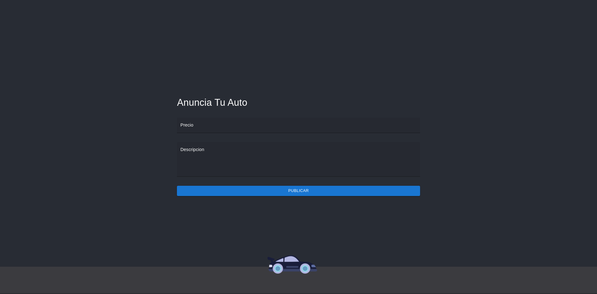

# Examen Practico Intellimotor

Aplicacion de creacion de anuncios con webscrapping

## Prerequisitos de instalacion
- ### [Node.js](https://nodejs.org/en/download/)
- ### [Git](https://git-scm.com/downloads)

## Instrucciones de instalacion
1. ### Copiar el repositorio de github en el directorio deseado
    ```bash
    $   git clone https://github.com/PargaTolano/intellimotor-examen-practico.git
    ```
2. ### Navegar al directorio del repositorio
    ```bash
    $   cd intellimotor-examen-practico
    ```
3. ### Navegar al directorio del backend en una terminal
    ```bash
    $   cd backend
    ```
4. ### Iniciar el servidor introduciendo el siguiente comando
    ```bash
    $   npm run start
    ```
5. ### Esperar a que la terminar imprima la siguiente linea
    ```bash
    2022-09-10T18:11:06.039Z [examen-backend] info: escuchando peticiones en puerto -> 8081
    ```
6. ### Navegar en otra terminal al directorio de frontend
    ```bash
    $    cd frontend
    ```
7. ### Inciar aplicacion de frontend introduciendo este comando
    ```bash
    $    npm run start
    ```
    #### Una ventana de tu navegador predeterminado se desplegara con la aplicacion de frontend abierta y podras enviar tus peticiones
    